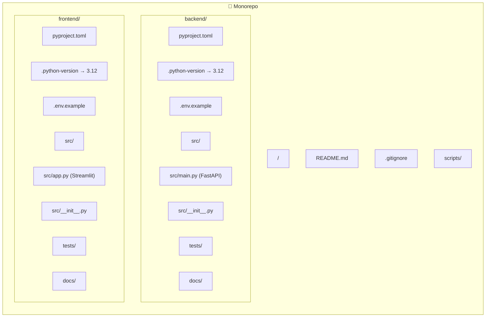

# Documento de Design — Estrutura Base do Projeto

## Visão Geral

Este design descreve a configuração da estrutura base do projeto Dashboard de Produtividade Dev. O objetivo é criar um monorepo com dois subprojetos Python independentes (`backend/` e `frontend/`), cada um com seu próprio `pyproject.toml` gerenciado via `uv`, variáveis de ambiente documentadas, convenções de código via Ruff, e aplicações mínimas funcionais (FastAPI `/health` e Streamlit título).

O design prioriza:
- **Isolamento**: cada subprojeto tem seu próprio ambiente virtual e dependências
- **Reprodutibilidade**: `uv sync` é o único comando necessário para instalar dependências
- **Segurança**: `.gitignore` protege dados sensíveis; `.env.example` documenta sem expor
- **Convenção**: Ruff configurado com PEP 8 desde o início

## Arquitetura



### Decisões de Arquitetura

1. **Monorepo com subprojetos independentes**: Backend e frontend vivem no mesmo repositório mas possuem `pyproject.toml` separados. Isso permite `uv sync` independente em cada um, sem conflitos de dependências (ex: FastAPI não precisa do Streamlit e vice-versa).

2. **`uv` como gerenciador exclusivo**: Conforme diretriz do projeto, `pip`, `poetry` e `requirements.txt` são proibidos. Toda operação passa por `uv add`, `uv sync` e `uv run`.

3. **`.python-version` por subprojeto**: Cada diretório (`backend/`, `frontend/`) terá seu próprio arquivo `.python-version` fixando Python 3.12, garantindo que `uv` use a versão correta ao criar o ambiente virtual.

4. **Ruff no `pyproject.toml`**: A configuração do linter fica dentro do próprio `pyproject.toml` de cada subprojeto (seção `[tool.ruff]`), evitando arquivos de configuração extras.

## Componentes e Interfaces

### 1. Backend — `backend/`

| Arquivo | Responsabilidade |
|---|---|
| `pyproject.toml` | Metadados do projeto, dependências de produção e dev, configuração do Ruff |
| `.python-version` | Fixa Python 3.12 |
| `.env.example` | Documenta variáveis de ambiente com placeholders |
| `src/__init__.py` | Marca `src` como pacote Python |
| `src/main.py` | Aplicação FastAPI mínima com rota `/health` e logging via Loguru |
| `tests/` | Diretório para testes (pytest) |
| `docs/` | Diretório para documentação do backend |

**Dependências de produção**: `fastapi`, `uvicorn`, `loguru`, `python-dotenv`, `langchain`, `chromadb`, `aisuite`, `sqlite-utils`

**Dependências de desenvolvimento**: `pytest`, `ruff`

**Rota `/health`**:
```json
GET /health → 200 OK
{
  "status": "healthy"
}
```

**Inicialização**: O `main.py` configura Loguru como logger padrão no startup da aplicação FastAPI, usando `LOG_LEVEL` do `.env`.

### 2. Frontend — `frontend/`

| Arquivo | Responsabilidade |
|---|---|
| `pyproject.toml` | Metadados do projeto, dependências de produção e dev, configuração do Ruff |
| `.python-version` | Fixa Python 3.12 |
| `.env.example` | Documenta variáveis de ambiente com placeholders |
| `src/__init__.py` | Marca `src` como pacote Python |
| `src/app.py` | Aplicação Streamlit mínima com título "Dashboard de Produtividade Dev" |
| `tests/` | Diretório para testes (pytest) |
| `docs/` | Diretório para documentação do frontend |

**Dependências de produção**: `streamlit`, `plotly`, `python-dotenv`, `requests`

**Dependências de desenvolvimento**: `pytest`, `ruff`

### 3. Raiz do Repositório

| Arquivo | Responsabilidade |
|---|---|
| `README.md` | Descrição do projeto, pré-requisitos, instruções de setup, estrutura de diretórios, stack técnica |
| `.gitignore` | Regras para excluir `.env`, `.venv/`, `__pycache__/`, `*.db`, `*.sqlite`, `*.sqlite3`, `chroma_data/` |
| `scripts/` | Diretório para scripts utilitários |

### 4. Configuração do Ruff (ambos subprojetos)

```toml
[tool.ruff]
target-version = "py312"
line-length = 88

[tool.ruff.lint]
select = ["E", "F", "W", "I"]
```

- `E`: erros de estilo pycodestyle
- `F`: erros pyflakes
- `W`: warnings pycodestyle
- `I`: ordenação de imports (isort)

## Modelos de Dados

Este requisito não envolve modelos de dados persistentes. Os "dados" relevantes são:

### Estrutura do `pyproject.toml` (Backend)

```toml
[project]
name = "dashboard-produtividade-backend"
version = "0.1.0"
description = "Backend do Dashboard de Produtividade Dev"
requires-python = ">=3.12"
dependencies = [
    "fastapi",
    "uvicorn",
    "loguru",
    "python-dotenv",
    "langchain",
    "chromadb",
    "aisuite",
    "sqlite-utils",
]

[dependency-groups]
dev = [
    "pytest",
    "ruff",
]

[tool.ruff]
target-version = "py312"
line-length = 88

[tool.ruff.lint]
select = ["E", "F", "W", "I"]
```

### Estrutura do `pyproject.toml` (Frontend)

```toml
[project]
name = "dashboard-produtividade-frontend"
version = "0.1.0"
description = "Frontend do Dashboard de Produtividade Dev"
requires-python = ">=3.12"
dependencies = [
    "streamlit",
    "plotly",
    "python-dotenv",
    "requests",
]

[dependency-groups]
dev = [
    "pytest",
    "ruff",
]

[tool.ruff]
target-version = "py312"
line-length = 88

[tool.ruff.lint]
select = ["E", "F", "W", "I"]
```

### Variáveis de Ambiente — Backend (`.env.example`)

```env
# GitHub
GITHUB_TOKEN=seu_token_aqui
GITHUB_USERNAME=seu_usuario_aqui
GITHUB_GRAPHQL_URL=https://api.github.com/graphql

# Banco de Dados
CHROMADB_PATH=./chroma_data
SQLITE_DB_PATH=./data.db

# Logging
LOG_LEVEL=DEBUG

# LLM / Ollama
OLLAMA_BASE_URL=http://localhost:11434
OLLAMA_MODEL=llama3.1:8b

# Embeddings
EMBEDDING_MODEL=intfloat/multilingual-e5-large

# Servidor
APP_PORT=8000
```

### Variáveis de Ambiente — Frontend (`.env.example`)

```env
# Backend API
BACKEND_API_URL=http://localhost:8000

# Streamlit
STREAMLIT_SERVER_PORT=8501
```


## Propriedades de Corretude

*Uma propriedade é uma característica ou comportamento que deve ser verdadeiro em todas as execuções válidas de um sistema — essencialmente, uma declaração formal sobre o que o sistema deve fazer. Propriedades servem como ponte entre especificações legíveis por humanos e garantias de corretude verificáveis por máquina.*

A maioria dos critérios de aceite deste requisito são verificações estáticas de estrutura de arquivos e conteúdo fixo (existência de diretórios, presença de dependências específicas, conteúdo do README). Estes são melhor testados como exemplos concretos em testes unitários.

As propriedades universais identificadas dizem respeito à consistência dos arquivos `.env.example`:

### Propriedade 1: Presença de variáveis obrigatórias nos arquivos .env.example

*Para qualquer* subprojeto (backend ou frontend) e *para qualquer* variável na lista de variáveis obrigatórias desse subprojeto, essa variável deve estar definida no arquivo `.env.example` correspondente.

**Valida: Requisitos 4.1, 4.2**

### Propriedade 2: Placeholders não-vazios nos arquivos .env.example

*Para qualquer* variável definida em *qualquer* arquivo `.env.example` do projeto, o valor atribuído (placeholder) não deve ser uma string vazia — deve conter um valor descritivo que indique ao desenvolvedor o que preencher.

**Valida: Requisitos 4.3, 4.4**

## Tratamento de Erros

Este requisito trata da configuração inicial do projeto, portanto o tratamento de erros é mínimo e focado na aplicação backend:

### Backend (`src/main.py`)

1. **Carregamento de `.env`**: Se o arquivo `.env` não existir, a aplicação deve iniciar normalmente usando valores padrão ou variáveis de ambiente do sistema. O `python-dotenv` já trata isso silenciosamente.

2. **Rota `/health`**: Sempre retorna 200 OK com JSON `{"status": "healthy"}`. Não há cenários de erro nesta rota mínima.

3. **Logging (Loguru)**: Configurado no startup. Se `LOG_LEVEL` não estiver definido, usar `DEBUG` como padrão.

### Frontend (`src/app.py`)

1. **Carregamento de `.env`**: Mesmo comportamento do backend — falha silenciosa se `.env` não existir.

2. **Página inicial**: Apenas renderiza um título estático. Sem cenários de erro.

### Erros de Setup

| Cenário | Comportamento Esperado |
|---|---|
| `uv sync` falha por Python errado | Mensagem de erro do `uv` indicando versão incompatível |
| `.env` não existe | Aplicação inicia com valores padrão |
| Porta já em uso | Erro padrão do uvicorn/streamlit |

## Estratégia de Testes

### Abordagem Dual

Este requisito utiliza tanto testes unitários quanto testes baseados em propriedades, de forma complementar:

- **Testes unitários**: Verificam exemplos concretos — existência de arquivos, conteúdo específico do `pyproject.toml`, resposta da rota `/health`, presença de padrões no `.gitignore`, conteúdo do README.
- **Testes de propriedade**: Verificam propriedades universais sobre os arquivos `.env.example` — presença de variáveis obrigatórias e placeholders não-vazios.

### Biblioteca de Testes de Propriedade

- **Biblioteca**: `hypothesis` (Python)
- **Configuração**: Mínimo 100 iterações por teste de propriedade
- **Cada teste de propriedade deve referenciar a propriedade do design**
- **Formato de tag**: `Feature: project-base-setup, Property {número}: {texto}`

### Testes Unitários (pytest)

Os testes unitários cobrem os critérios de aceite que são exemplos concretos:

1. **Estrutura de diretórios** (Req 1): Verificar existência de `backend/src/`, `backend/tests/`, `backend/docs/`, `frontend/src/`, `frontend/tests/`, `frontend/docs/`, `scripts/`
2. **`__init__.py`** (Req 1): Verificar existência em `backend/src/` e `frontend/src/`
3. **`pyproject.toml` do backend** (Req 2): Parsear e verificar nome, versão, requires-python, dependências de produção e dev
4. **`pyproject.toml` do frontend** (Req 3): Mesmo do item 3 para o frontend
5. **`.python-version`** (Req 2, 3): Verificar conteúdo `3.12` em ambos subprojetos
6. **`.gitignore`** (Req 5): Verificar presença de padrões `.env`, `.venv/`, `__pycache__/`, `*.db`, `*.sqlite`, `*.sqlite3`, `chroma_data/`
7. **README** (Req 6): Verificar presença de seções chave (descrição, pré-requisitos, setup backend, setup frontend, estrutura, stack)
8. **Rota `/health`** (Req 7): Usar `TestClient` do FastAPI para verificar status 200 e JSON `{"status": "healthy"}`
9. **Loguru configurado** (Req 7): Verificar que o import e configuração do loguru existem no `main.py`
10. **Streamlit app** (Req 8): Verificar que `app.py` contém `st.title("Dashboard de Produtividade Dev")`
11. **Ruff configurado** (Req 9): Parsear `pyproject.toml` e verificar seção `[tool.ruff]` em ambos subprojetos

### Testes de Propriedade (hypothesis)

Cada propriedade de corretude é implementada por um único teste baseado em propriedade:

1. **Feature: project-base-setup, Property 1: Presença de variáveis obrigatórias nos arquivos .env.example**
   - Gerar subprojeto aleatório (backend/frontend) e variável aleatória da lista obrigatória correspondente
   - Verificar que a variável está presente no `.env.example` do subprojeto
   - Mínimo 100 iterações

2. **Feature: project-base-setup, Property 2: Placeholders não-vazios nos arquivos .env.example**
   - Para cada variável em cada `.env.example`, verificar que o valor após `=` não é vazio
   - Gerar pares aleatórios (arquivo, variável) e verificar
   - Mínimo 100 iterações
