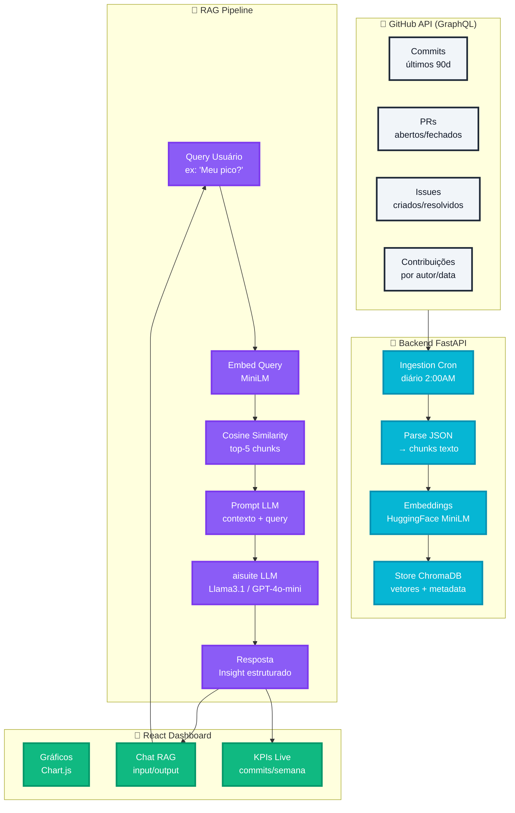
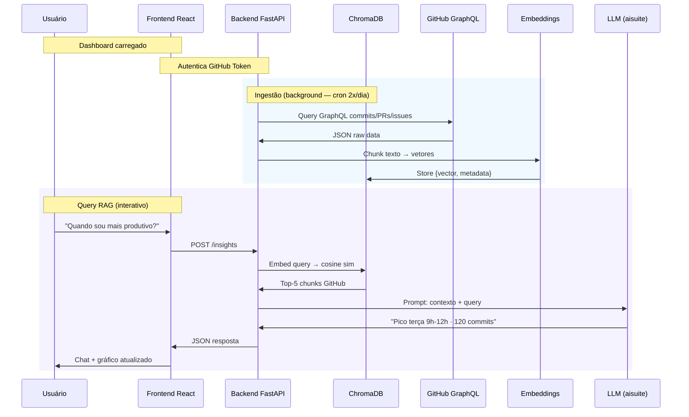
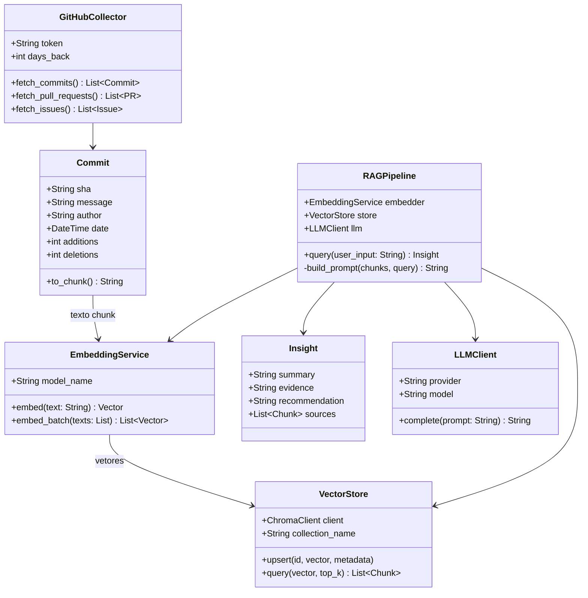

<div align="center">

# 📊 Dashboard Produtividade Dev

**Full-Stack · RAG · Embeddings · GitHub Analytics**

[](https://python.org)
[](https://fastapi.tiangolo.com)
[](https://react.dev)
[](https://www.trychroma.com)
[](LICENSE)

> Dashboard inteligente que analisa sua produtividade como dev diretamente dos dados reais do GitHub — commits, PRs e issues — com insights gerados por IA via RAG (Retrieval-Augmented Generation).

</div>

---

## 🎯 Sobre o Projeto

O **Dashboard Produtividade Dev** conecta sua conta GitHub e transforma dados brutos de contribuições em **insights acionáveis** sobre seus padrões de trabalho. Com uma pipeline RAG alimentada por embeddings reais dos seus commits, você pode perguntar em linguagem natural:

- _"Quando sou mais produtivo durante a semana?"_
- _"Qual foi meu melhor sprint dos últimos 90 dias?"_
- _"Em quais tipos de tarefas gasto mais tempo?"_

---

## 🏗️ Arquitetura Geral



---

## 🔄 Fluxo de Dados Detalhado



---

## 🧩 Diagrama de Classes (Domínio)

> ⚠️ **Diagrama conceitual** — gerado a partir da documentação de arquitetura. Sujeito a revisão conforme implementação do código.



---

## 🛠️ Stack Tecnológica

| Camada | Tecnologia | Responsabilidade |
|--------|-----------|------------------|
| **Data Source** | GitHub GraphQL API | Commits, PRs e issues reais |
| **Backend** | FastAPI + Cron | API REST + ingestão agendada |
| **Vector DB** | ChromaDB | Armazenamento de vetores + metadata |
| **Embeddings** | HuggingFace MiniLM (384D) | Transformação texto → vetor |
| **LLM** | aisuite (Ollama / OpenAI) | Geração de insights estruturados |
| **Frontend** | React + Chart.js | Dashboard interativo + chat |
| **Deploy** | Vercel + Railway | Frontend + Backend em produção |

---

## 📁 Estrutura do Projeto

```
dashboard-produtividade-dev/
├── backend/
│   ├── src/            # Código-fonte FastAPI
│   ├── tests/          # Testes unitários e de integração
│   ├── docs/           # Documentação do backend
│   └── .env.example    # Variáveis de ambiente (template)
├── frontend/
│   ├── src/            # Componentes React
│   ├── tests/          # Testes do frontend
│   ├── docs/           # Documentação do frontend
│   └── .env.example    # Variáveis de ambiente (template)
├── scripts/            # Scripts auxiliares (seed, migration, etc.)
├── docs/
│   └── fluxograma_dashboard_produtividade.md
├── .github/            # Workflows CI/CD
├── .gitignore
└── README.md
```

---

## 🚀 Como Executar

### Pré-requisitos

- Python 3.11+
- Node.js 18+
- Token GitHub com escopo `read:user` e `repo`
- [Ollama](https://ollama.ai) instalado localmente (para modo dev)

### Backend

```bash
# Clone o repositório
git clone https://github.com/IA-para-DEVs-SD/dashboard-produtividade-dev.git
cd dashboard-produtividade-dev/backend

# Crie e ative o ambiente virtual
python -m venv .venv
source .venv/bin/activate  # Windows: .venv\Scripts\activate

# Instale dependências
pip install -r requirements.txt

# Configure variáveis de ambiente
cp .env.example .env
# Edite o .env com seu GITHUB_TOKEN e configurações LLM

# Inicie o servidor
uvicorn src.main:app --reload
```

### Frontend

```bash
cd ../frontend

# Instale dependências
npm install

# Configure variáveis de ambiente
cp .env.example .env

# Inicie o servidor de desenvolvimento
npm run dev
```

---

## ⚙️ Variáveis de Ambiente

### Backend (`backend/.env`)

```env
GITHUB_TOKEN=ghp_xxxxxxxxxxxxxxxxxxxx
GITHUB_USERNAME=seu_usuario

# LLM — escolha o provider
LLM_PROVIDER=ollama          # ou: openai
LLM_MODEL=llama3.1           # ou: gpt-4o-mini

# ChromaDB
CHROMA_PATH=./data/chroma
CHROMA_COLLECTION=github_activity

# Ingestão
INGESTION_DAYS_BACK=90
```

### Frontend (`frontend/.env`)

```env
VITE_API_URL=http://localhost:8000
```

---

## ✅ Validações do Sistema

| # | Feature | Fluxo | Status |
|---|---------|-------|--------|
| 1 | **Dados Reais** | GitHub GraphQL → JSON → chunks → embeddings → ChromaDB | ✅ |
| 2 | **RAG Funcional** | Query → embed → top-5 chunks → LLM → insight | ✅ |
| 3 | **Full-Stack** | React ↔ FastAPI ↔ ChromaDB ↔ GitHub | ✅ |
| 4 | **Provider Agnostic** | `ollama:llama3.1` (dev) / `openai:gpt-4o-mini` (prod) | ✅ |
| 5 | **Escalável** | Cron 2x/dia · 90 dias · ~10k commits · ~50MB ChromaDB | ✅ |

---

## 📄 Licença

Este projeto está licenciado sob a [MIT License](LICENSE).

---

<div align="center">
Feito com 🧠 + ☕ pela equipe <strong>IA para DEVs SD</strong>
</div>