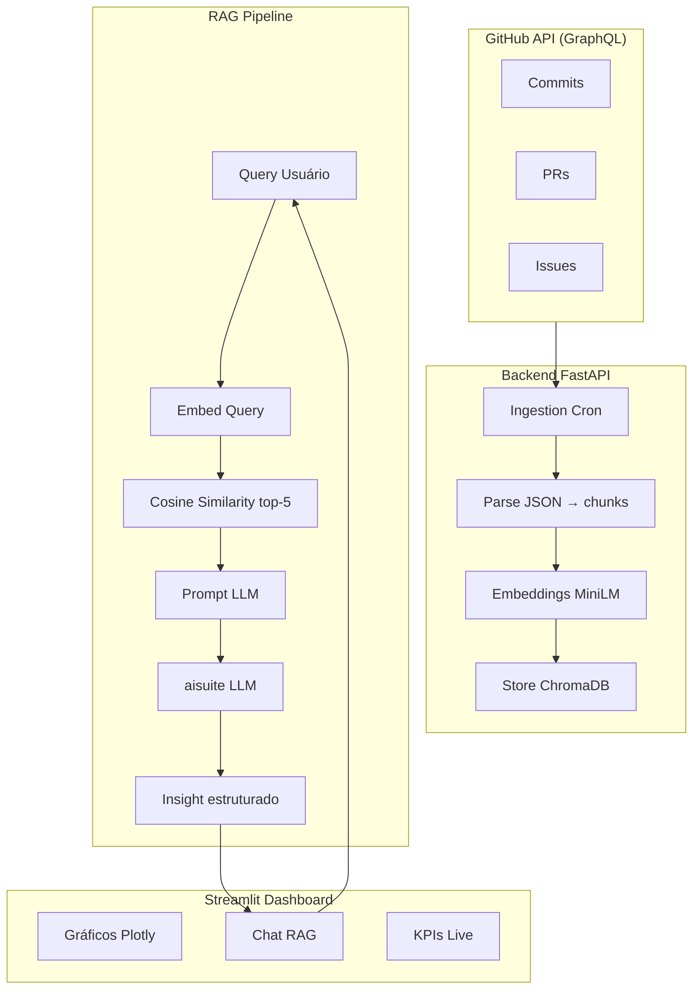

# Dashboard Produtividade Dev

Dashboard inteligente que analisa produtividade de desenvolvedores a partir de dados reais do GitHub — commits, PRs e issues — com insights gerados por IA via RAG (Retrieval-Augmented Generation).

---

## Sumário

- [Tecnologias Utilizadas](#tecnologias-utilizadas)
- [Arquitetura](#arquitetura)
- [Estrutura do Projeto](#estrutura-do-projeto)
- [Instalação e Uso](#instalação-e-uso)
- [Variáveis de Ambiente](#variáveis-de-ambiente)
- [Documentações](#documentações)
- [Integrantes do Grupo](#integrantes-do-grupo)

---

## Tecnologias Utilizadas

| Camada | Tecnologia |
|--------|-----------|
| Data Source | GitHub GraphQL API |
| Backend | FastAPI + Uvicorn |
| Vector DB | ChromaDB (embedded) |
| Embeddings | HuggingFace (`all-MiniLM-L6-v2`, 384D) |
| LLM | aisuite (Ollama / OpenAI) |
| Frontend | Streamlit + Plotly |
| Banco de Dados | SQLite via SQLModel |
| Logging | Loguru + correlation IDs |
| Rate Limiting | slowapi |
| Gerenciamento | uv |

---

## Arquitetura



---

## Estrutura do Projeto

```
dashboard-produtividade-dev/
├── backend/
│   ├── src/
│   │   ├── main.py             # App FastAPI + CORS + rate limiting
│   │   ├── config.py           # Pydantic Settings (.env)
│   │   ├── database.py         # Engine SQLModel
│   │   ├── logging_config.py   # Loguru + correlation IDs
│   │   ├── github/             # Coleta via GraphQL API
│   │   ├── rag/                # Pipeline RAG (embeddings, vector store, LLM)
│   │   ├── routes/             # Endpoints REST
│   │   └── services/           # Ingestão, métricas, persistência
│   ├── tests/                  # Testes unitários + propriedade + integração
│   ├── pyproject.toml
│   └── .env.example
├── frontend/
│   ├── src/
│   │   ├── app.py              # App Streamlit (navegação)
│   │   ├── api_client.py       # Cliente HTTP para o backend
│   │   └── pages/              # Dashboard, Chat RAG, Configurações
│   ├── tests/
│   ├── pyproject.toml
│   └── .env.example
├── scripts/                    # Scripts auxiliares
├── .github/workflows/          # CI/CD (lint + testes)
├── docker-compose.yml          # Stack completa (Ollama + backend + frontend)
└── README.md
```

---

## Instalação e Uso

### Pré-requisitos

- [Python 3.12](https://www.python.org/downloads/)
- [uv](https://docs.astral.sh/uv/getting-started/installation/) — gerenciador de dependências e ambientes virtuais
- Token GitHub com escopo `read:user` e `repo`
- [Ollama](https://ollama.com/) instalado localmente (modo dev)

### Execução Rápida (3 terminais)

| Terminal | Comando |
|----------|---------|
| 1 - LLM | `ollama serve` |
| 2 - Backend | `cd backend && uv run uvicorn src.main:app --host 0.0.0.0 --port 8000` |
| 3 - Frontend | `cd frontend && uv run streamlit run src/app.py` |

Acesse: **http://localhost:8501**

### Ollama (LLM local)

```bash
# Instalar Ollama
curl -fsSL https://ollama.ai/install.sh | sh

# Baixar modelo (primeira vez)
ollama pull llama3.1

# Iniciar servidor LLM
ollama serve
```

### Backend

```bash
cd backend

# Instale dependências (usa uv, não pip)
uv sync

# Configure variáveis de ambiente
cp .env.example .env
# Edite o .env com seu GITHUB_TOKEN

# Inicie o servidor
uv run uvicorn src.main:app --host 0.0.0.0 --port 8000
```

O backend estará disponível em `http://localhost:8000`.

### Frontend

```bash
cd frontend

cp .env.example .env

# Instale dependências
uv sync

# Inicie o servidor Streamlit
uv run streamlit run src/app.py
```

O frontend estará disponível em `http://localhost:8501`.

---

## Variáveis de Ambiente

### Backend (`backend/.env`)

```env
GITHUB_TOKEN=ghp_xxxxxxxxxxxxxxxxxxxx
GITHUB_USERNAME=seu_usuario

LLM_PROVIDER=ollama
LLM_MODEL=llama3.1
OLLAMA_HOST=http://localhost:11434
OPENAI_API_KEY=sk-xxxxxxxxxxxxxxxxxxxx

CHROMA_PATH=./data/chroma
CHROMA_COLLECTION=github_activity

SQLITE_DB_PATH=./data.db

INGESTION_DAYS_BACK=90

CORS_ORIGINS=["http://localhost:8501"]
```

### Frontend (`frontend/.env`)

```env
BACKEND_API_URL=http://localhost:8000
BACKEND_PUBLIC_URL=http://localhost:8000
STREAMLIT_SERVER_PORT=8501
```

---

## Documentações

- [Fluxograma do projeto](fluxograma_dashboard_produtividade.md)
- [Documento de arquitetura](.kiro/docs-iniciais/dashboard-de-produtividade-dev.md)
- [Diretrizes GitFlow](.kiro/docs-iniciais/gitflow_kiro_guidelines.md)
- [Diretrizes uv](.kiro/docs-iniciais/uv_kiro_guidelines.md)

---

## Integrantes do Grupo

<!-- Liste os integrantes do grupo aqui -->
- [Nome do integrante](https://github.com/usuario)

---

Licença [MIT](LICENSE) · IA para DEVs SD
