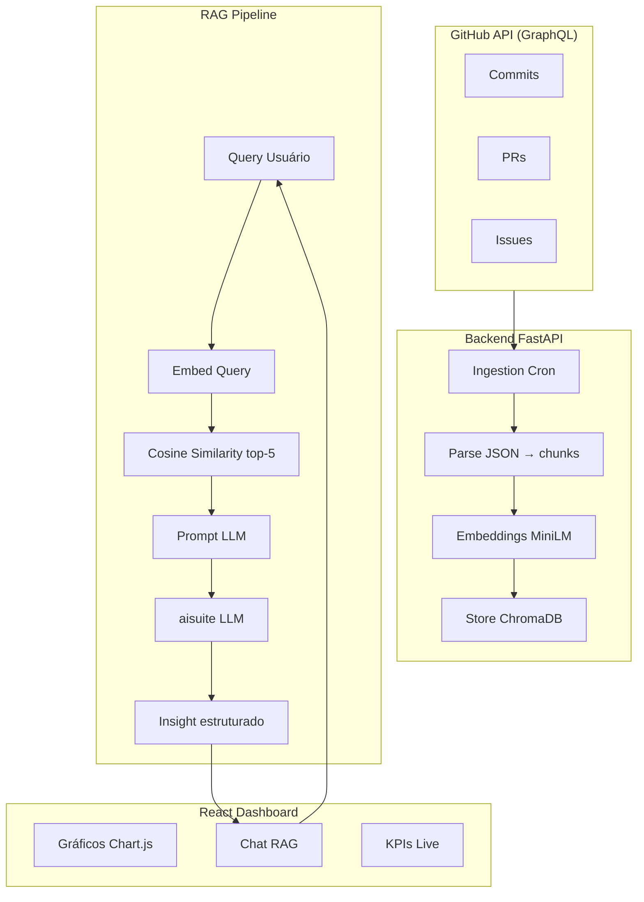

# Dashboard Produtividade Dev

Dashboard inteligente que analisa produtividade de desenvolvedores a partir de dados reais do GitHub — commits, PRs e issues — com insights gerados por IA via RAG (Retrieval-Augmented Generation).

---

## Sumário

- [Tecnologias Utilizadas](#tecnologias-utilizadas)
- [Arquitetura](#arquitetura)
- [Estrutura do Projeto](#estrutura-do-projeto)
- [Instalação e Uso](#instalação-e-uso)
- [Variáveis de Ambiente](#variáveis-de-ambiente)
- [Documentações](#documentações)
- [Integrantes do Grupo](#integrantes-do-grupo)

---

## Tecnologias Utilizadas

| Camada | Tecnologia |
|--------|-----------|
| Data Source | GitHub GraphQL API |
| Backend | FastAPI + Cron |
| Vector DB | ChromaDB |
| Embeddings | HuggingFace MiniLM (384D) |
| LLM | aisuite (Ollama / OpenAI) |
| Frontend | React + Chart.js |
| Deploy | Vercel + Railway |

---

## Arquitetura



---

## Estrutura do Projeto

```
dashboard-produtividade-dev/
├── backend/
│   ├── src/            # Código-fonte FastAPI
│   ├── tests/          # Testes
│   ├── docs/           # Documentação do backend
│   └── .env.example
├── frontend/
│   ├── src/            # Componentes React
│   ├── tests/          # Testes
│   ├── docs/           # Documentação do frontend
│   └── .env.example
├── scripts/            # Scripts auxiliares
├── .github/            # Workflows CI/CD
└── README.md
```

---

## Instalação e Uso

### Pré-requisitos

- Python 3.11+
- Node.js 18+
- Token GitHub com escopo `read:user` e `repo`
- [Ollama](https://ollama.ai) instalado localmente (modo dev)

### Backend

```bash
git clone https://github.com/IA-para-DEVs-SD/dashboard-produtividade-dev.git
cd dashboard-produtividade-dev/backend

python -m venv .venv
source .venv/bin/activate  # Windows: .venv\Scripts\activate

pip install -r requirements.txt

cp .env.example .env
# edite o .env com seu GITHUB_TOKEN e configurações LLM

uvicorn src.main:app --reload
```

### Frontend

```bash
cd frontend

npm install

cp .env.example .env

npm run dev
```

---

## Variáveis de Ambiente

### Backend (`backend/.env`)

```env
GITHUB_TOKEN=ghp_xxxxxxxxxxxxxxxxxxxx
GITHUB_USERNAME=seu_usuario
LLM_PROVIDER=ollama
LLM_MODEL=llama3.1
CHROMA_PATH=./data/chroma
CHROMA_COLLECTION=github_activity
INGESTION_DAYS_BACK=90
```

### Frontend (`frontend/.env`)

```env
VITE_API_URL=http://localhost:8000
```

---

## Documentações

- [Fluxograma do projeto](fluxograma_dashboard_produtividade.md)
- [Documento de arquitetura](.kiro/docs-iniciais/dashboard-de-produtividade-dev.md)
- [Diretrizes GitFlow](.kiro/docs-iniciais/gitflow_kiro_guidelines.md)
- [Diretrizes uv](.kiro/docs-iniciais/uv_kiro_guidelines.md)

---

## Integrantes do Grupo

<!-- Liste os integrantes do grupo aqui -->
- [Nome do integrante](https://github.com/usuario)

---

Licença [MIT](LICENSE) · IA para DEVs SD
