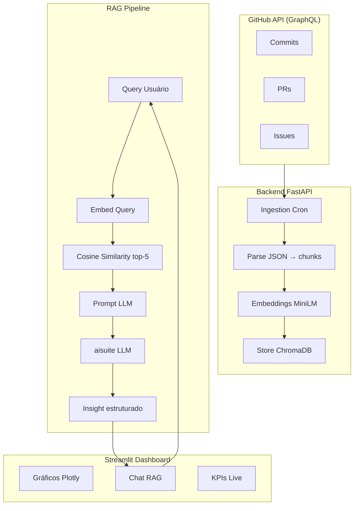

# Dashboard Produtividade Dev

Dashboard inteligente que analisa produtividade de desenvolvedores a partir de dados reais do GitHub — commits, PRs e issues — com insights gerados por IA via RAG (Retrieval-Augmented Generation).

---

## Sumário

- [Tecnologias Utilizadas](#tecnologias-utilizadas)
- [Arquitetura](#arquitetura)
- [Estrutura do Projeto](#estrutura-do-projeto)
- [Instalação e Uso](#instalação-e-uso)
- [Variáveis de Ambiente](#variáveis-de-ambiente)
- [Documentações](#documentações)
- [Integrantes do Grupo](#integrantes-do-grupo)

---

## Tecnologias Utilizadas

| Camada | Tecnologia |
|--------|-----------|
| Data Source | GitHub GraphQL API |
| Backend | FastAPI + Uvicorn + LangChain |
| Vector DB | ChromaDB |
| Embeddings | HuggingFace (`intfloat/multilingual-e5-large`) |
| LLM | aisuite (Ollama / OpenAI) |
| Frontend | Streamlit + Plotly |
| Banco de Dados | SQLite (`sqlite-utils`) |
| Logging | Loguru |
| Gerenciamento | uv |

---

## Arquitetura



---

## Estrutura do Projeto

```
dashboard-produtividade-dev/
├── backend/
│   ├── src/
│   │   ├── __init__.py
│   │   └── main.py          # Aplicação FastAPI
│   ├── tests/                # Testes
│   ├── docs/                 # Documentação do backend
│   ├── pyproject.toml
│   ├── .python-version
│   └── .env.example
├── frontend/
│   ├── src/
│   │   ├── __init__.py
│   │   └── app.py            # Aplicação Streamlit
│   ├── tests/                # Testes
│   ├── docs/                 # Documentação do frontend
│   ├── pyproject.toml
│   ├── .python-version
│   └── .env.example
├── scripts/                  # Scripts auxiliares
├── .github/                  # Workflows CI/CD
└── README.md
```

---

## Instalação e Uso

### Pré-requisitos

- [Python 3.12](https://www.python.org/downloads/)
- [uv](https://docs.astral.sh/uv/getting-started/installation/) — gerenciador de dependências e ambientes virtuais
- Token GitHub com escopo `read:user` e `repo`
- [Ollama](https://ollama.com/) instalado localmente (modo dev)

### Backend

```bash
git clone https://github.com/IA-para-DEVs-SD/dashboard-produtividade-dev.git
cd dashboard-produtividade-dev/backend

cp .env.example .env
# edite o .env com seu GITHUB_TOKEN e configurações LLM

uv sync
uv run python -m src.main
```

O backend estará disponível em `http://localhost:8000` (ou na porta definida em `APP_PORT` no `.env`).

### Frontend

```bash
cd frontend

cp .env.example .env

uv sync
uv run streamlit run src/app.py
```

O frontend estará disponível em `http://localhost:8501`.

---

## Variáveis de Ambiente

### Backend (`backend/.env`)

```env
GITHUB_TOKEN=seu_token_aqui
GITHUB_USERNAME=seu_usuario_aqui
GITHUB_GRAPHQL_URL=https://api.github.com/graphql
CHROMADB_PATH=./chroma_data
SQLITE_DB_PATH=./data.db
LOG_LEVEL=DEBUG
OLLAMA_BASE_URL=http://localhost:11434
OLLAMA_MODEL=llama3.1:8b
EMBEDDING_MODEL=intfloat/multilingual-e5-large
APP_PORT=8000
```

### Frontend (`frontend/.env`)

```env
BACKEND_API_URL=http://localhost:8000
STREAMLIT_SERVER_PORT=8501
```

---

## Documentações

- [Fluxograma do projeto](fluxograma_dashboard_produtividade.md)
- [Documento de arquitetura](.kiro/docs-iniciais/dashboard-de-produtividade-dev.md)
- [Diretrizes GitFlow](.kiro/docs-iniciais/gitflow_kiro_guidelines.md)
- [Diretrizes uv](.kiro/docs-iniciais/uv_kiro_guidelines.md)

---

## Integrantes do Grupo

<!-- Liste os integrantes do grupo aqui -->
- [Nome do integrante](https://github.com/usuario)

---

Licença [MIT](LICENSE) · IA para DEVs SD
