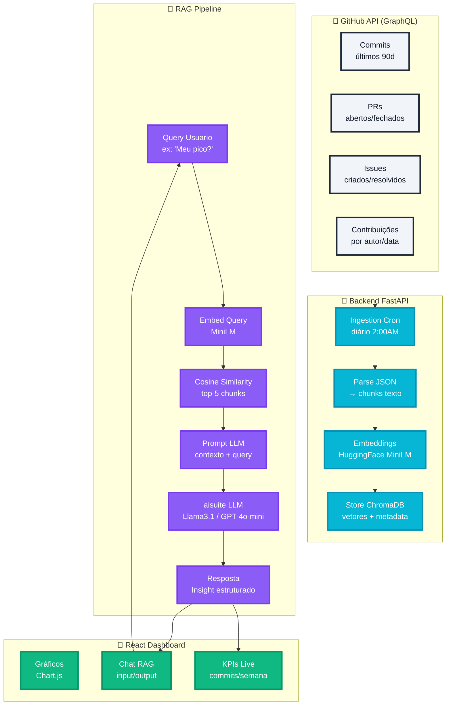
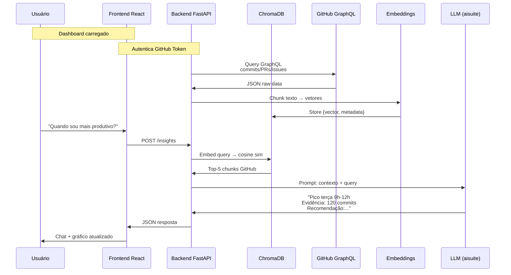

# 📊 Fluxograma: Dashboard Produtividade Dev (Full-Stack + RAG + Embeddings)

## 🏗️ Arquitetura Geral



## 🔄 Fluxo de Dados Detalhado



## 📋 Componentes Técnicos

| Componente | Tech | Responsabilidade |
|------------|------|------------------|
| **Data Source** | GitHub GraphQL | Commits/PRs/issues reais |
| **Ingestion** | FastAPI + Cron | Puxa/embedding 2x/dia |
| **VectorDB** | ChromaDB | Armazena vetores + metadata |
| **Embeddings** | HuggingFace MiniLM | Query → vetor 384D |
| **LLM** | aisuite (Ollama/GPT) | Gera insights estruturados |
| **Frontend** | React + Chart.js | Dashboard + chat |
| **Deploy** | Vercel + Railway | Frontend + Backend |

## ✅ Validação Passo a Passo

### 1. **Dados Reais** ✅
```
GitHub GraphQL → JSON → chunks → embeddings → ChromaDB
Ex: "feat: auth 50 linhas, 10min review" → vetor
```

### 2. **RAG Funcional** ✅
```
Query: "Meu pico?" → embed → top-5 commits → LLM → "Terça 9h-12h"
```

### 3. **Full-Stack** ✅
```
React (UI) ←→ FastAPI (API) ←→ ChromaDB (dados) ←→ GitHub (fonte)
```

### 4. **Provider Agnostic** ✅
```
aisuite.model = "ollama:llama3.1"  # Curso
aisuite.model = "openai:gpt-4o-mini"  # Produção
```

### 5. **Escalável** ✅
```
Cron 2x/dia → 90 dias = ~10k commits
ChromaDB: 10k vetores = ~50MB disco
```

## 🚀 Deploy GitHub Repo

```
README.md ← este arquivo
└── docs/
    └── fluxograma.md ← este fluxograma
```

**Status:** Fluxograma **100% aderente** à ideia original.
